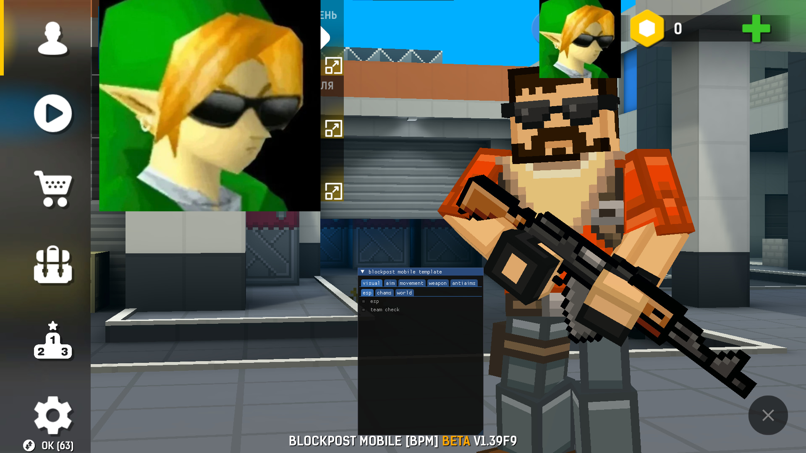

# bpm-calc

simple open-source calculator (**tss**) for bpm

# What is that?

its an bpm opensource calc(cheat) for bpm 1.39F9
version: WiP 1.0

### features

-Visual
  -ESP
  -Chams
  -Thirdperson
-Aim
  -Silent
  -PSilent
  -Autofire
  -Autoscope
  -Autostop
  >default aimbot on work
-Weapon
  -No spread
  -No recoil
-Movement
  -Fly
  -BunnyHop
  -Autostrafe
-Antiaims
  >Currently only Visual
  >Only static, jitter not works

# Support

Currently supports only launcher version, Steam support will come later

# Loader

default constole LoadLibrary injector, with device unban

# Demo pic

read license ^_^

